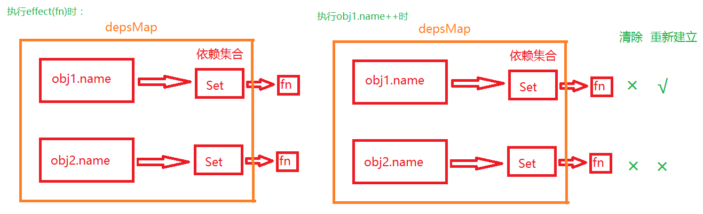

经过上一节，我们已经成功实现了一个简单的响应式系统。但是这个响应式系统还存在诸多的问题，我们这一节将尝试解决无效分支触发依赖的问题。

# 无效分支触发依赖的问题

首先先来理解什么是无效分支触发依赖。

我们执行下列的单测，就会发现执行结果并没有达到预期：

```ts
describe('effect', () => {
    it("分支处理", () => {
        const obj1 = reactive({ num: 1 }),
            obj2 = reactive({ num: 2 })

        const fn = jest.fn(() => {
            obj1.num === 1 ? obj2.num : false
        })
        effect(fn)

        obj1.num++
        expect(fn).toHaveBeenCalledTimes(2)
        // 此时obj1.num!==1
        // 应该走false的分支，所以读取obj2.num理应不触发依赖
        obj2.num++
        expect(fn).toHaveBeenCalledTimes(2)
    })
})
```

可以看到在单测中，执行完 `obj1.num++` 语句之后，函数 fn 一共被执行了两次：第一次是作为 effect 函数的参数被执行，第二次是执行 `obj1.num++` 语句触发依赖后被执行。

而且在执行完 `obj1.num++` 语句后，obj1.num 的值为 2。按照 fn 函数中的条件语句，obj2.name 应该不会被访问到，所以此时若对 obj2.name 进行修改，理应不触发 fn 函数。

但是通过单测我们可以看到，执行 `obj2.num++` 语句后，fn 函数应该不会被触发，所以 fn 函数依赖只被触发两次。但运行单测后结果却是被触发 3 次。


毫无疑问，是因为对 obj2.name 的修改依然会触发 fn 函数执行造成的。这就是无效分支触发依赖。

知道原因后，我们就可以着手解决问题。

这个问题的关键，是在于 **当副作用函数中的代理对象属性不再被访问时，该代理对象属性的依赖集合没有对该副作用函数进行清除**。

而解决该问题的思路，就是**当每次触发依赖时，对该副作用函数相关的代理对象属性进行清空，使其重新收集依赖**。

对于这里，文字的描述可能稍微有些晦涩，我们可以通过画图来理解这一点：



如图，当执行 `effect(fn)` 时，obj1.name 和 obj2.name 同时收集 fn 函数为依赖。当 `obj1.name++` 触发依赖时，先清空与 fn 函数相关的依赖集合中对 fn 依赖函数的联系，再重新收集依赖。此时因为只有访问 obj1.name，所以只有 obj1.name 收集 fn 函数为依赖。

所以，我们首先要解决的第一个问题，就是**如何通过副作用函数获取依赖集合**。如果能获取到，我们就可以直接在该依赖集合中对副作用函数进行清除。

我们只需要**在 activeEffect 上将依赖集合保存在一个新属性 deps 中，之后我们就可以通过 deps 访问该依赖集合**。

因为 activeEffect 可能会有多个依赖集合，比如以上的单测中，执行 `effect(fn)` 语句时，就会有 obj1.name 和 obj2.name 两个依赖集合。所以 activeEffect 的 deps 属性应该是一个**数组**，其中的元素为多个依赖集合：

```ts
export class ReactiveEffect {
  private _fn: () => any;
  // 数组
  public deps: any[];

  constructor(fn: () => any) {
    this._fn = fn;
    this.deps = [];
  }

  // 省略以下代码
}
```

我们在 trackEffect 中对 deps 进行收集即可：

```ts
export function trackEffect(effectSet: Set<any>) {
  effectSet.add(activiteEffect);
  // 向deps中添加依赖集合
  activiteEffect.deps.push(effectSet);
}
```

所以下一个问题，是我们**如何清除该依赖集合的该副作用函数**。因为依赖集合是一个 Set，所以我们**直接调用 Set 集合上的方法 delete 对副作用函数进行删除**即可。此处可以封装为一个**清除函数 cleanupEffect**：

```ts
function cleanupEffect(effect: ReactiveEffect) {
  // 使用解构赋值获取依赖集合
  const { deps } = effect
  if (deps.length) {
    // 遍历与该副作用函数相关的所有依赖集合
    for (let i = 0; i < deps.length; i++) {
      // 删除依赖集合中该副作用函数
      deps[i].delete(effect)
    }
    // 将依赖集合中的该副作用函数清除后，
    // 该副作用函数已经没有相关的依赖集合了，
    // 故应该对 deps 进行清空
    deps.length = 0
  }
}
```

该函数应该是在每次重新触发依赖之前被调用，进行清除后重新收集依赖。所以将其放在在 ReactiveEffect.run 方法中使用：

```ts
export class ReactiveEffect {
  // 省略以上代码

  run(): any {
    activiteEffect = this;
    // 先清空
    cleanupEffect(activiteEffect);
    // 再收集
    return this._fn();
  }
}
```

但是此时重新运行单测，就会尴尬的发现进入了无限循环。

但是这并不是以上代码实现的有问题，而是因为在 js 语法中，使用 for...of 对集合进行遍历时，**如果在遍历的代码块中对集合同时进行删除和新增，就会造成该遍历无限循环**。

而我们**在 triggerEffect 函数中触发依赖时，通过 run 方法调用 cleanupEffect 对集合进行清除，又通过 track 函数对集合进行新增依赖，就相当于在遍历的代码块中对集合同时进行删除和新增**，所以就会造成无限循环。

解决方法很简单，只要**不遍历该集合，而是遍历等同于该集合元素的数组**即可：

```ts
export function triggerEffect(effectSet: Dep | undefined) {
  if (effectSet) {
    // 转换为数组，因为遍历时一边增肌一边删除会造成无限循环
    const effects: ReactiveEffect[] = [];
    for (const dep of effectSet) {
      if (dep) {
        effects.push(dep);
      }
    }
    for (const effect of effects) {
      effect.run();
    }
  }
}
```

到此为止，我们的这个单测应该就能正常通过了。

（此处实现的代码及命名方式会尽量靠拢 vue3 源码中的实现方式及命名方式，为的是方便读者后续方便对照源码和扩展。但也不尽是，有时并不会拘泥于源码。 :joy:）
